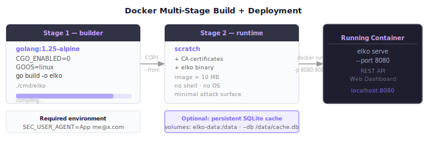

# Docker Deployment



elko ships with a multi-stage Dockerfile and a docker-compose configuration for easy containerized deployment.

---

## Table of Contents

1. [Quick Start](#quick-start)
2. [Build the Image](#build-the-image)
3. [Configuration](#configuration)
4. [Persistent Cache](#persistent-cache)
5. [docker-compose Reference](#docker-compose-reference)
6. [Dockerfile Details](#dockerfile-details)
7. [Health Check](#health-check)
8. [Running Without Compose](#running-without-compose)

---

## Quick Start

```bash
# 1. Set your SEC contact (required for EDGAR tools)
export SEC_USER_AGENT="MyApp me@example.com"

# 2. Start the service
docker compose up

# 3. Open the dashboard
open http://localhost:8080

# 4. Or call a tool directly
curl -s -XPOST localhost:8080/v1/call/yahoo_quote \
  -H 'Content-Type: application/json' \
  -d '{"symbol":"AAPL"}'
```

---

## Build the Image

### Using docker-compose (recommended)

```bash
docker compose build
docker compose up
```

### Manual build

```bash
docker build -t elko-market-mcp .
```

### Build args

The Dockerfile uses a multi-stage build:
- **Stage 1 (builder):** `golang:1.25-alpine` — compiles the binary with CGO disabled
- **Stage 2 (runtime):** `scratch` — minimal image containing only the binary and CA certificates

Binary is compiled with:
```
CGO_ENABLED=0 GOOS=linux GOARCH=amd64 go build -ldflags="-s -w" -o /elko ./cmd/elko
```

The `-s -w` flags strip debug info and DWARF tables for a smaller binary.

---

## Configuration

### Environment Variables

| Variable | Required | Description |
|----------|----------|-------------|
| `SEC_USER_AGENT` | For EDGAR tools | `"AppName contact@email.com"` — per [SEC policy](https://www.sec.gov/developer) |

Set in `docker-compose.yml`:

```yaml
environment:
  SEC_USER_AGENT: "MyApp me@example.com"
```

Or pass at runtime:

```bash
SEC_USER_AGENT="MyApp me@example.com" docker compose up
```

### Port

Default: `8080`. Change in `docker-compose.yml`:

```yaml
ports:
  - "9090:8080"   # host:container
```

### Source Filtering

To restrict which data sources are enabled, override the `command` in `docker-compose.yml`:

```yaml
command: ["serve", "--port", "8080", "--sources", "yahoo,edgar"]
```

---

## Persistent Cache

By default, the container uses in-memory cache only — responses are lost when the container restarts.

Enable SQLite persistence by mounting a volume:

```yaml
volumes:
  - elko-data:/data

# The compose file already does this. The cache file lives at /data/cache.db
# which maps to the elko-data named volume.
```

The cache file is passed to the binary via `--db /data/cache.db` (already configured in `docker-compose.yml`).

**Custom host path:**

```yaml
volumes:
  - /home/user/.elko:/data
```

This mounts the host directory `/home/user/.elko` as `/data` in the container.

---

## docker-compose Reference

```yaml
services:
  elko:
    build: .
    ports:
      - "8080:8080"
    volumes:
      - elko-data:/data
    environment:
      SEC_USER_AGENT: "MyApp me@example.com"
    command: ["serve", "--port", "8080", "--db", "/data/cache.db"]
    healthcheck:
      test: ["/elko", "catalogue", "--sources", "yahoo"]
      interval: 30s
      timeout: 10s
      retries: 3
      start_period: 5s
    restart: unless-stopped

volumes:
  elko-data:
```

### Override options

```bash
# Different port
docker compose run --rm -p 9000:8080 elko serve --port 8080

# Only Yahoo Finance
docker compose run --rm -p 8080:8080 elko serve --port 8080 --sources yahoo

# No cache persistence
docker compose run --rm -p 8080:8080 elko serve --port 8080

# Run the CLI
docker compose run --rm elko call yahoo_quote symbol=AAPL
```

---

## Dockerfile Details

```dockerfile
# Stage 1: Build
FROM golang:1.25-alpine AS builder
WORKDIR /build
COPY go.mod go.sum ./
RUN go mod download
COPY . .
RUN CGO_ENABLED=0 GOOS=linux GOARCH=amd64 \
    go build -ldflags="-s -w" -o /elko ./cmd/elko

# Stage 2: Runtime
FROM scratch
COPY --from=builder /etc/ssl/certs/ca-certificates.crt /etc/ssl/certs/
COPY --from=builder /elko /elko
ENTRYPOINT ["/elko"]
CMD ["serve", "--port", "8080"]
```

**Key points:**
- `scratch` base = zero OS footprint, no shell, no package manager
- CA certificates copied from builder for HTTPS calls to external APIs
- `CGO_ENABLED=0` enables static linking (required for scratch base)
- Final image size: ~15–20 MB (mostly the Go binary)

---

## Health Check

The compose file includes a healthcheck that verifies the binary can load and query tools:

```yaml
healthcheck:
  test: ["/elko", "catalogue", "--sources", "yahoo"]
  interval: 30s
  timeout: 10s
  retries: 3
  start_period: 5s
```

This runs `elko catalogue --sources yahoo` every 30 seconds. If it fails 3 times, the container is marked unhealthy.

Check container health:

```bash
docker compose ps
docker inspect elko-market-mcp-elko-1 | jq '.[0].State.Health'
```

---

## Running Without Compose

```bash
# Build image
docker build -t elko .

# Run with in-memory cache
docker run -p 8080:8080 -e SEC_USER_AGENT="MyApp me@example.com" elko

# Run with persistent cache
docker run -p 8080:8080 \
  -e SEC_USER_AGENT="MyApp me@example.com" \
  -v /home/user/.elko:/data \
  elko serve --port 8080 --db /data/cache.db

# Run CLI mode
docker run --rm \
  -e SEC_USER_AGENT="MyApp me@example.com" \
  elko call yahoo_quote symbol=AAPL

# Run MCP mode (for remote MCP setups)
docker run -i \
  -e SEC_USER_AGENT="MyApp me@example.com" \
  elko mcp
```

---

## Troubleshooting

### "certificate signed by unknown authority"

CA certificates are embedded from the builder stage. If you see this error in a custom base image, ensure `/etc/ssl/certs/ca-certificates.crt` is present.

### SEC EDGAR returns 403

Set `SEC_USER_AGENT` to a valid `"AppName contact@email.com"` string. The SEC blocks requests without proper identification.

### Container exits immediately

Check logs: `docker compose logs elko`. Common causes:
- Port already in use — change the host port in `ports:`
- Invalid `--sources` flag — use lowercase: `yahoo`, `edgar`, etc.

### Data not persisting between restarts

Ensure the volume is mounted and `--db` points to the volume path (`/data/cache.db`).
