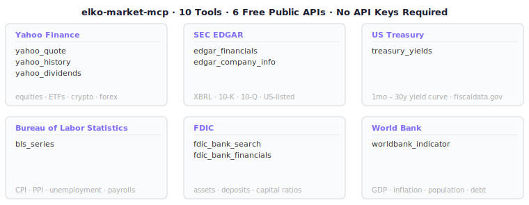
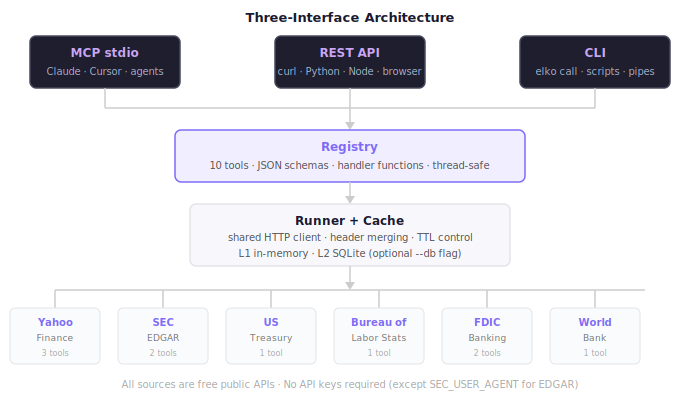

# elko-market-mcp — Technical Documentation

**Version 0.1.0** | Updated 2026-03-04

This is the master index for the elko-market-mcp technical documentation. All formal product documentation lives in this `docs/` directory and is maintained in sync with the codebase.

---

## Table of Contents

### Getting Started
1. [Quick Start Guide](QUICKSTART.md)
   - [Build from source](QUICKSTART.md#build-from-source)
   - [Environment setup](QUICKSTART.md#environment-setup)
   - [First run: MCP](QUICKSTART.md#interface-1-mcp-server)
   - [First run: CLI](QUICKSTART.md#interface-2-cli)
   - [First run: REST + Web Dashboard](QUICKSTART.md#interface-3-rest-api--web-dashboard)

### Reference
2. [Tool Reference](TOOLS.md)
   - [yahoo_quote](TOOLS.md#yahoo_quote)
   - [yahoo_history](TOOLS.md#yahoo_history)
   - [yahoo_dividends](TOOLS.md#yahoo_dividends)
   - [edgar_financials](TOOLS.md#edgar_financials)
   - [edgar_company_info](TOOLS.md#edgar_company_info)
   - [treasury_yields](TOOLS.md#treasury_yields)
   - [bls_series](TOOLS.md#bls_series)
   - [fdic_bank_search](TOOLS.md#fdic_bank_search)
   - [fdic_bank_financials](TOOLS.md#fdic_bank_financials)
   - [worldbank_indicator](TOOLS.md#worldbank_indicator)

3. [REST API Reference](REST-API.md)
   - [Endpoints](REST-API.md#endpoints)
   - [Authentication](REST-API.md#authentication)
   - [Request format](REST-API.md#request-format)
   - [Response format](REST-API.md#response-format)
   - [Error handling](REST-API.md#error-handling)

4. [API Keys & Credentials](API-KEYS.md)
   - [Current channels](API-KEYS.md#current-channels)
   - [Planned channels](API-KEYS.md#planned-channels--key-requirements)
   - [Setting keys for CLI / MCP / Docker](API-KEYS.md#setting-keys)

5. [MCP Setup Guide](MCP-SETUP.md)
   - [Claude Code](MCP-SETUP.md#claude-code)
   - [Claude Desktop](MCP-SETUP.md#claude-desktop)
   - [Cursor](MCP-SETUP.md#cursor)
   - [Any MCP client](MCP-SETUP.md#generic-mcp-client)

### Extending elko
6. [Adding a New Channel](CHANNELS.md)
   - [How channels work](CHANNELS.md#how-channels-work)
   - [The two files you need](CHANNELS.md#the-two-files-you-need)
   - [Worked example: CoinGecko](CHANNELS.md#worked-example-coingecko-market-chart)
   - [JSON spec reference](CHANNELS.md#json-spec-reference)
   - [Extractor function reference](CHANNELS.md#extractor-function-reference)
   - [Tips and patterns](CHANNELS.md#tips-and-patterns)

### Architecture & Internals
7. [Architecture](ARCHITECTURE.md)
   - [Three-interface design](ARCHITECTURE.md#three-interface-design)
   - [Channel pipeline](ARCHITECTURE.md#channel-pipeline)
   - [Registry](ARCHITECTURE.md#registry)
   - [Channel spec format](ARCHITECTURE.md#channel-spec-format)
   - [Cache system](ARCHITECTURE.md#cache-system)
   - [Extractor pattern](ARCHITECTURE.md#extractor-pattern)
   - [Web frontend](ARCHITECTURE.md#web-frontend)

8. [Phase 2 Design: SQLite-Native Pipeline](PIPELINE-DESIGN.md)
   - [Motivation](PIPELINE-DESIGN.md#1-the-core-insight)
   - [MapperFunc contract](PIPELINE-DESIGN.md#8-the-mapperfunc-contract)
   - [Cross-channel joins](PIPELINE-DESIGN.md#10-cross-channel-joins)
   - [Implementation roadmap](PIPELINE-DESIGN.md#13-implementation-roadmap)

### Deployment
9. [Docker Deployment](DOCKER.md)
   - [Quick start with docker-compose](DOCKER.md#quick-start)
   - [Build image manually](DOCKER.md#build-the-image)
   - [Configuration](DOCKER.md#configuration)
   - [Persistent cache](DOCKER.md#persistent-cache)

### Cookbook
10. [How-To & Workflow Examples](HOW-TO.md)
   - [All 10 tools with CLI + REST examples](HOW-TO.md#tool-reference--example-calls)
   - [Earnings deep dive](HOW-TO.md#earnings-season-deep-dive)
   - [Macro context workflow](HOW-TO.md#macro-context-for-a-trade)
   - [Banking sector check](HOW-TO.md#banking-sector-check)

---

## Project Overview





elko-market-mcp is a single Go binary (`elko`) that provides free financial market data through three simultaneous interfaces: MCP stdio server, REST API, and CLI. It aggregates six public data sources into a unified, cached, schema-driven tool catalogue.

### Source Summary

```
Yahoo Finance    → Equity/ETF/crypto/forex quotes, OHLCV history, dividends
SEC EDGAR        → Financial statements (XBRL), company metadata
US Treasury      → Yield curve (1mo–30y)
BLS              → CPI, PPI, unemployment, payrolls, any series
FDIC             → Bank search, assets/deposits/capital ratios
World Bank       → GDP, inflation, population, debt — any country
```

### Interface Summary

| Interface | Command | Use Case |
|-----------|---------|----------|
| MCP stdio | `elko mcp` | Claude, Cursor, any AI assistant |
| REST + Web | `elko serve` | Browser UI, curl, programmatic access |
| CLI | `elko call <tool>` | Scripts, one-shot queries, pipelines |
| Catalogue | `elko catalogue` | Discover tools and their schemas |

### Key Design Principles

- **Data-driven** — each tool is a JSON spec; Go code handles only source-specific parsing
- **Three interfaces, one registry** — MCP, REST, and CLI all share the same tool catalogue
- **Caching** — in-memory L1 + optional SQLite L2 with per-tool TTL
- **Zero static HTML** — the web UI generates itself from the `/v1/catalogue` endpoint
- **No external JS** — charts, export, and UI are pure JavaScript with no npm dependencies

---

## Changelog Summary

| Version | Date | Highlights |
|---------|------|-----------|
| 0.1.0 | 2026-03-04 | Export (txt/csv/json), pure-SVG charts, chart panel layout |
| 0.1.0 | 2026-03-04 | Date picker for date fields |
| 0.1.0 | 2026-03-04 | Copy button, URL state, result history, table overflow |
| 0.1.0 | 2026-03-04 | HTTP server (`serve` command), REST API endpoints |
| 0.1.0 | 2026-03-04 | Initial release: 10 tools, MCP + CLI + REST |

---

## File Structure

```
elko-market-mcp/
├── README.md                    ← Project overview and quick start
├── cmd/elko/main.go             ← CLI entry point (4 commands)
├── internal/
│   ├── api/server.go            ← REST API (Chi router)
│   ├── mcp/server.go            ← MCP stdio server (JSON-RPC 2.0)
│   ├── registry/registry.go     ← Unified tool catalogue
│   ├── cache/cache.go           ← In-memory + SQLite L2 cache
│   └── channel/
│       ├── spec.go              ← Spec struct, LoadFS(), TTL parsing
│       ├── runner.go            ← HTTP client, fetch closure, registration
│       └── extract/             ← Per-source extractors (6 files)
├── channels/                    ← Embedded JSON channel specs (10 files)
│   ├── yahoo/                   ← quote.json, history.json, dividends.json
│   ├── edgar/                   ← financials.json, company_info.json
│   ├── treasury/                ← yields.json
│   ├── bls/                     ← series.json
│   ├── fdic/                    ← bank_search.json, bank_financials.json
│   └── worldbank/               ← indicator.json
├── web/
│   ├── index.html               ← 5-line shell
│   └── src/
│       ├── app.js               ← Layout, history, URL state
│       ├── sidebar.js           ← Tool tree navigation
│       ├── form-builder.js      ← Schema → HTML form generator
│       ├── chart.js             ← Pure-SVG line/bar charts
│       ├── renderer.js          ← CSV/table/KV/sections renderers
│       ├── export.js            ← TXT/CSV/JSON export + clipboard
│       ├── runner.js            ← Tool invocation
│       └── style.css            ← Layout and styling
├── docs/
│   ├── INDEX.md                 ← This file
│   ├── QUICKSTART.md            ← Build and first run
│   ├── TOOLS.md                 ← Complete tool reference
│   ├── MCP-SETUP.md             ← MCP client configuration
│   ├── REST-API.md              ← REST endpoint reference
│   ├── ARCHITECTURE.md          ← Technical design
│   ├── CHANNELS.md              ← How to add new channels
│   ├── DOCKER.md                ← Container deployment
│   ├── HOW-TO.md                ← Workflow cookbook
│   └── PIPELINE-DESIGN.md       ← Phase 2 architecture proposal
├── Dockerfile                   ← Multi-stage build (scratch runtime)
├── docker-compose.yml           ← Service definition + healthcheck
├── .mcp.json                    ← MCP registration for Claude Code
├── .env.example                 ← Environment variable template
└── go.mod / go.sum              ← Go module dependencies
```
