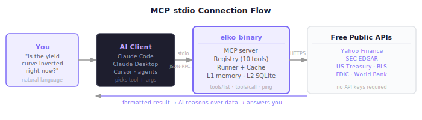

# MCP Setup Guide

How to configure elko as an MCP (Model Context Protocol) server for various AI clients.



---

## Table of Contents

1. [What is MCP?](#what-is-mcp)
2. [Prerequisites](#prerequisites)
3. [Claude Code](#claude-code)
4. [Claude Desktop](#claude-desktop)
5. [Cursor](#cursor)
6. [Generic MCP Client](#generic-mcp-client)
7. [Verifying the Connection](#verifying-the-connection)
8. [Source Filtering via MCP](#source-filtering-via-mcp)
9. [Troubleshooting](#troubleshooting)

---

## What is MCP?

Model Context Protocol (MCP) is an open standard that allows AI assistants to call external tools. When elko runs as an MCP server, your AI assistant can call any of the 10 financial data tools automatically based on natural language prompts — no manual URL construction or API calls needed.

```
You: "Is the yield curve inverted right now?"
AI:  [calls treasury_yields with latest=true]
AI:  "Based on current Treasury rates, the 2-year yield (4.89%) exceeds the
      10-year yield (4.23%), indicating an inverted curve..."
```

elko implements MCP over **stdio** (standard in/out), which is the standard transport for local MCP servers.

---

## Prerequisites

1. **Build the binary**: `go build -o elko ./cmd/elko`
2. **Set SEC_USER_AGENT**: Required for EDGAR tools (see below)
3. **Note the absolute path** to the `elko` binary

```bash
which elko    # if installed to PATH
# or
pwd           # note the directory and use /full/path/elko
```

---

## Claude Code

Claude Code looks for an `.mcp.json` file in the project root or `~/.mcp.json` globally.

### Project-scoped (`.mcp.json` in repo root)

This repo includes a `.mcp.json` template. Update the binary path:

```json
{
  "mcpServers": {
    "elko-market": {
      "type": "stdio",
      "command": "/absolute/path/to/elko",
      "args": ["mcp"],
      "env": {
        "SEC_USER_AGENT": "MyApp me@example.com"
      }
    }
  }
}
```

Replace `/absolute/path/to/elko` with the actual binary path.

### Global (`~/.mcp.json`)

Same format. Tools will be available in all Claude Code sessions.

### Reload

After editing `.mcp.json`, restart Claude Code or run `/mcp` to reload servers.

---

## Claude Desktop

Claude Desktop reads its MCP configuration from a platform-specific config file.

### Config file locations

| Platform | Path |
|----------|------|
| macOS | `~/Library/Application Support/Claude/claude_desktop_config.json` |
| Linux | `~/.config/claude/claude_desktop_config.json` |
| Windows | `%APPDATA%\Claude\claude_desktop_config.json` |

### Configuration

```json
{
  "mcpServers": {
    "elko-market": {
      "command": "/absolute/path/to/elko",
      "args": ["mcp"],
      "env": {
        "SEC_USER_AGENT": "MyApp me@example.com"
      }
    }
  }
}
```

**Note:** Claude Desktop uses `"command"` (not `"type": "stdio"` + `"command"`).

Restart Claude Desktop after saving the config.

---

## Cursor

Cursor supports MCP via its settings. Add to `~/.cursor/mcp.json` (or the Cursor settings UI):

```json
{
  "mcpServers": {
    "elko-market": {
      "command": "/absolute/path/to/elko",
      "args": ["mcp"],
      "env": {
        "SEC_USER_AGENT": "MyApp me@example.com"
      }
    }
  }
}
```

Or via the Cursor UI: **Settings → MCP → Add Server** and fill in the command, args, and env fields.

---

## Generic MCP Client

For any MCP-compatible client, elko speaks standard JSON-RPC 2.0 over stdio.

**Command:**
```
/path/to/elko mcp
```

**Environment:**
```
SEC_USER_AGENT=MyApp me@example.com
```

**Protocol messages (for reference):**

```json
// Initialize
{"jsonrpc":"2.0","id":1,"method":"initialize","params":{"protocolVersion":"2024-11-05","capabilities":{},"clientInfo":{"name":"test","version":"1.0"}}}

// List tools
{"jsonrpc":"2.0","id":2,"method":"tools/list","params":{}}

// Call a tool
{"jsonrpc":"2.0","id":3,"method":"tools/call","params":{"name":"yahoo_quote","arguments":{"symbol":"AAPL"}}}

// Ping
{"jsonrpc":"2.0","id":4,"method":"ping","params":{}}
```

---

## Verifying the Connection

### In Claude Code

Ask Claude: `"What financial data tools do you have available?"` — it should list the 10 elko tools.

Or run a direct test: `"Get the current AAPL quote."` — Claude will call `yahoo_quote` and return live data.

### Manual stdio test

```bash
# Start elko in MCP mode
./elko mcp &

# Send initialize + tools/list
echo '{"jsonrpc":"2.0","id":1,"method":"initialize","params":{"protocolVersion":"2024-11-05","capabilities":{},"clientInfo":{"name":"test","version":"1"}}}' | ./elko mcp
```

### Check the catalogue

```bash
./elko catalogue
```

Should list all 10 tools with descriptions and schema summaries.

---

## Source Filtering via MCP

You can restrict which data sources are available when starting the MCP server. This is useful for reducing scope or working around connectivity issues.

```json
{
  "mcpServers": {
    "elko-market-yahoo-only": {
      "command": "/path/to/elko",
      "args": ["--sources", "yahoo", "mcp"],
      "env": { "SEC_USER_AGENT": "MyApp me@example.com" }
    }
  }
}
```

Available source names: `yahoo`, `edgar`, `treasury`, `bls`, `fdic`, `worldbank`

You can also run multiple named servers with different source sets:

```json
{
  "mcpServers": {
    "elko-equity": {
      "command": "/path/to/elko",
      "args": ["--sources", "yahoo,edgar", "mcp"]
    },
    "elko-macro": {
      "command": "/path/to/elko",
      "args": ["--sources", "treasury,bls,worldbank", "mcp"]
    }
  }
}
```

---

## Troubleshooting

### "Command not found" or binary not starting

- Use the absolute path to the binary
- Verify the binary is executable: `chmod +x /path/to/elko`
- Test it directly: `/path/to/elko catalogue`

### EDGAR tools return errors

- Ensure `SEC_USER_AGENT` is set in the MCP config's `env` block
- Format: `"AppName contact@email.com"` (per SEC policy)
- Test: `SEC_USER_AGENT="Test test@test.com" ./elko call edgar_company_info symbol=AAPL`

### Tools not appearing in Claude

- Check that the `.mcp.json` path is correct and the file is valid JSON
- Restart the MCP client after config changes
- Check for errors in the MCP client's log/console

### Slow first response

Normal — the first call fetches from the external API and populates the cache. Subsequent calls for the same data return from cache instantly. Use `--db` to persist the cache across restarts:

```json
{
  "args": ["--db", "/home/user/.elko-cache.db", "mcp"]
}
```

### Network / firewall issues

elko needs outbound HTTPS to:
- `query1.finance.yahoo.com` (Yahoo Finance)
- `data.sec.gov`, `efts.sec.gov` (SEC EDGAR)
- `api.fiscaldata.treasury.gov` (Treasury)
- `api.bls.gov` (BLS)
- `banks.data.fdic.gov` (FDIC)
- `api.worldbank.org` (World Bank)
