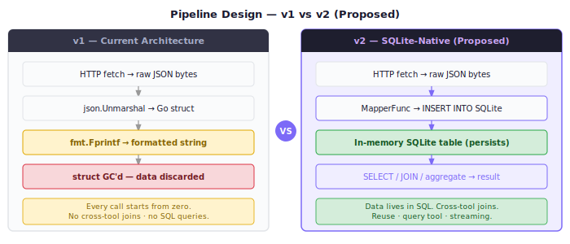
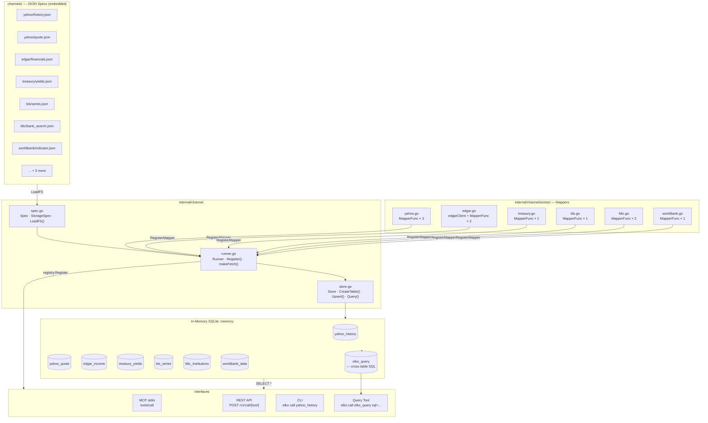
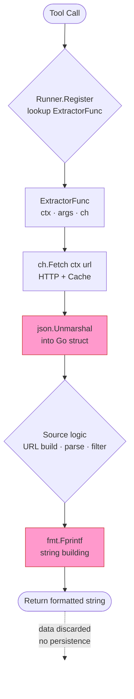
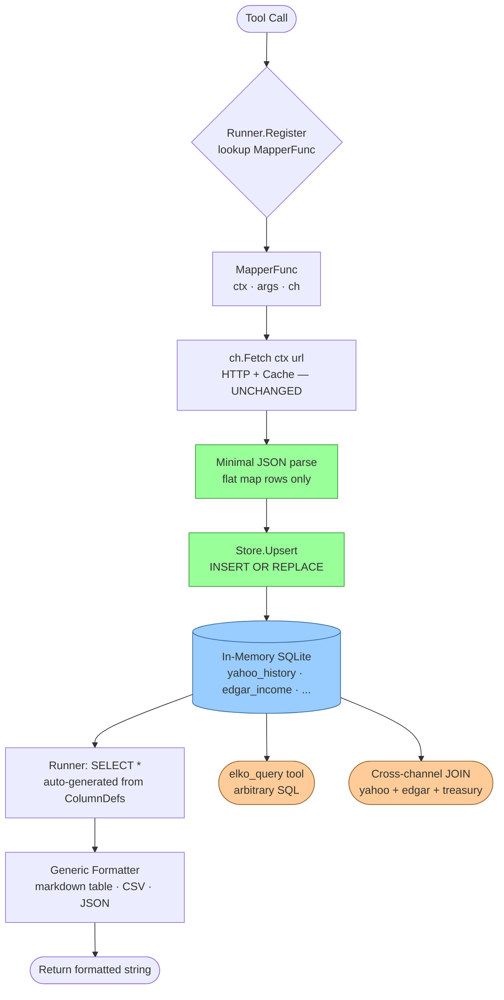
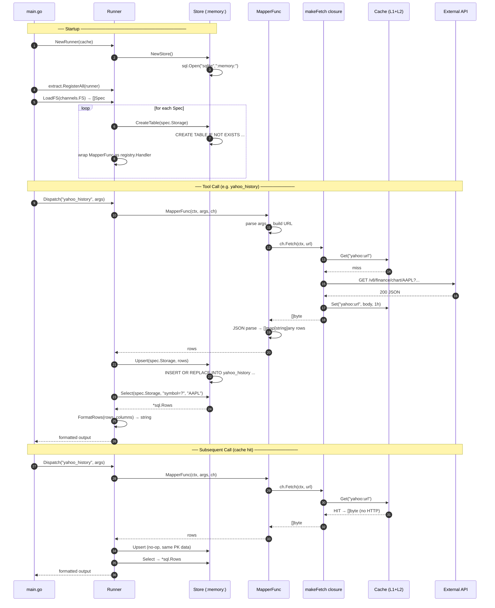
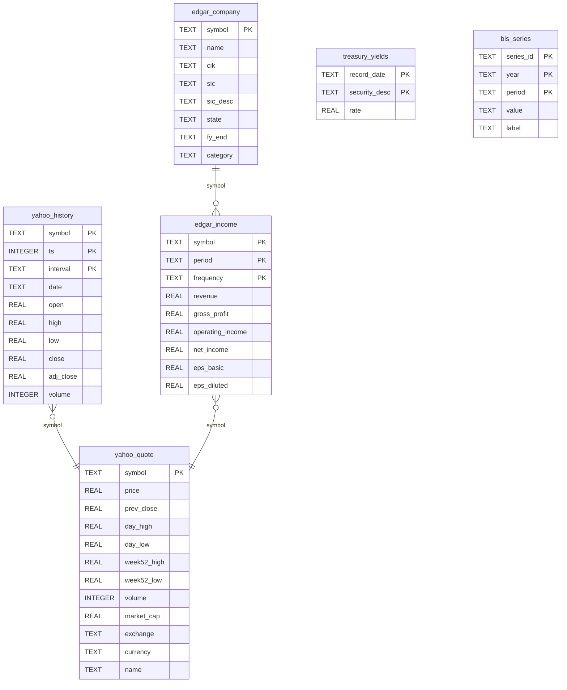
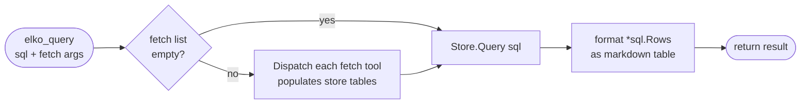
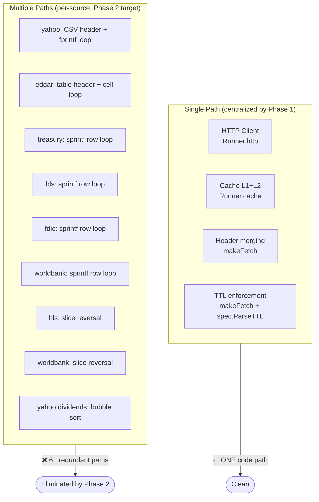
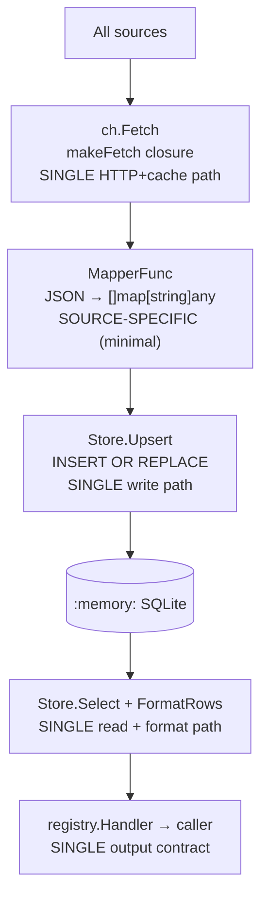

# elko-market-mcp: SQLite-Native Data Pipeline Architecture

**Version:** 2.0 (Proposed)
**Status:** Design — Pending Implementation
**Date:** 2026-03-04



---

## Table of Contents

1. [The Core Insight](#1-the-core-insight)
2. [Current Pipeline — Redundancy Audit](#2-current-pipeline--redundancy-audit)
3. [Architecture Overview](#3-architecture-overview)
4. [Data Flow: Before vs. After](#4-data-flow-before-vs-after)
5. [Channel Spec: Storage Block](#5-channel-spec-storage-block)
6. [Core Types](#6-core-types)
7. [The Store: In-Memory SQLite as Data Catalogue](#7-the-store-in-memory-sqlite-as-data-catalogue)
8. [The MapperFunc Contract](#8-the-mapperfunc-contract)
9. [Channel Lifecycle](#9-channel-lifecycle)
10. [Cross-Channel Joins](#10-cross-channel-joins)
11. [The Query Tool](#11-the-query-tool)
12. [I/O Pipeline Centralization](#12-io-pipeline-centralization)
13. [Implementation Roadmap](#13-implementation-roadmap)
14. [Future Extensions](#14-future-extensions)

---

## 1. The Core Insight

Today every extractor follows the same lifecycle:

```
Fetch HTTP bytes → unmarshal into Go struct → format string → return → struct GC'd
```

The Go struct is **temporary scaffolding**. It exists for microseconds, carries data nobody
can query, and gets garbage collected immediately. Every tool call starts from zero.

**The proposal:** replace the Go struct with an in-memory SQLite row as the primary runtime
data container.

```
Fetch HTTP bytes → thin mapper → INSERT OR REPLACE rows → SELECT → format
```

The SQLite row *is* the data structure. It persists across calls. It is queryable. It is
joinable with rows from other channels. Its schema is declared in JSON, not compiled Go.

This is not a storage optimization. It is a **computational model change**: the database
becomes the runtime, SQL becomes the logic layer, Go becomes the I/O adapter.

---

## 2. Current Pipeline — Redundancy Audit

The current `internal/channel/extract/` code (post Phase 1 refactor) was audited line by line.

### 2.1 What Is Already Centralized (Phase 1 wins)

| Concern | Location | Notes |
|---------|----------|-------|
| HTTP client (single instance) | `runner.go: Runner.http` | One `*http.Client` for all sources |
| Cache get/set | `runner.go: makeFetch` | Single code path, all sources |
| Header merging (static + env-var) | `runner.go: makeFetch` | Declared in JSON, applied once |
| TTL parsing + enforcement | `spec.go: ParseTTL` + `makeFetch` | Declared in JSON |
| Cache key namespacing | `runner.go: makeFetch` | `source:url` prefix |
| Tool registration boilerplate | `runner.go: Register` | One loop, no per-source code |

### 2.2 Remaining Redundancy (target of Phase 2)

| Pattern | Files Affected | Lines | Eliminatable? |
|---------|---------------|-------|---------------|
| Args struct + `json.Unmarshal` boilerplate | All 6 | ~28 | Partially — generic helper possible |
| `fmt.Fprintf` table/CSV output header + loop | All 6 | ~30 | **Yes** — generic tabular formatter from column defs |
| Empty-result message | All 6 | ~7 | **Yes** — generic `"no rows in {table} for {filter}"` |
| In-place slice reversal (chronological sort) | bls, worldbank | 6 | **Yes** — `ORDER BY` clause in spec |
| Label lookup with fallback (`map[key]` else `key`) | edgar, bls, worldbank | ~8 | Partial — move to column metadata |
| `safeF` / `safeI` bounds-checked array access | yahoo | 12 | **Yes** — SQL NULLs replace missing-index guards |
| Large-number formatter (T/B/M) | yahoo | 10 | **Yes** — SQL column display_format metadata |
| Dedup + sort before insert | edgar | 19 | **Yes** — `INSERT OR IGNORE` + `SELECT DISTINCT` |

### 2.3 Irreducible Per-Source Logic

This is the **minimal non-eliminatable core** — the only Go code that *must* remain per source:

| Source | What Stays | Est. Lines |
|--------|-----------|-----------|
| **yahoo** | JSON response struct; NaN filter on OHLCV; nested indicator array flattening | ~55 |
| **edgar** | CIK lookup with RWMutex cache; XBRL concept-tag fallback list; 10-K vs 10-Q filter | ~80 |
| **treasury** | JSON field name mapping (`record_date`, `security_desc`, `avg_interest_rate_amt`) | ~20 |
| **bls** | API status check (`REQUEST_SUCCEEDED`); nested Results.Series.Data unwrapping | ~20 |
| **fdic** | Active flag enum (`1` → `"Yes"`); dual endpoint (institutions vs financials) | ~25 |
| **worldbank** | 2-element JSON array envelope; `*float64` nil check | ~20 |

**Target:** Go code per source drops from ~180 avg lines to ~40 avg lines.
**Eliminated:** all output formatting, all ordering, all empty-result logic, all cache/HTTP code.

---

## 3. Architecture Overview



---

## 4. Data Flow: Before vs. After

### 4.1 Current Flow (Phase 1)



Red boxes = **eliminatable per-source redundancy**.

### 4.2 Proposed Flow (Phase 2)



Green boxes = **thin mandatory logic**. Blue = persistent store. Orange = emergent capabilities.

---

## 5. Channel Spec: Storage Block

One new top-level field added to each JSON spec. Everything else unchanged.

```json
{
  "name": "yahoo_history",
  "description": "OHLCV price history from Yahoo Finance.",
  "source": "yahoo",
  "category": "equity",
  "schema": {
    "type": "object",
    "properties": {
      "symbol":   { "type": "string" },
      "period":   { "type": "string" },
      "from":     { "type": "string" },
      "to":       { "type": "string" },
      "interval": { "type": "string" }
    },
    "required": ["symbol"]
  },
  "request": {
    "base_url": "https://query1.finance.yahoo.com/v8/finance/chart",
    "headers": { "User-Agent": "Mozilla/5.0 (compatible; elko-market-mcp/1.0)" },
    "ttl": "1h"
  },
  "response": {
    "extractor": "yahoo_chart_ohlcv"
  },
  "storage": {
    "table": "yahoo_history",
    "schema": [
      { "col": "symbol",    "type": "TEXT",    "pk": true  },
      { "col": "ts",        "type": "INTEGER", "pk": true  },
      { "col": "interval",  "type": "TEXT",    "pk": true  },
      { "col": "date",      "type": "TEXT"                 },
      { "col": "open",      "type": "REAL"                 },
      { "col": "high",      "type": "REAL"                 },
      { "col": "low",       "type": "REAL"                 },
      { "col": "close",     "type": "REAL"                 },
      { "col": "adj_close", "type": "REAL"                 },
      { "col": "volume",    "type": "INTEGER"              }
    ],
    "default_order": "ts ASC"
  }
}
```

### `StorageSpec` Fields

| Field | Type | Purpose |
|-------|------|---------|
| `table` | `string` | SQLite table name. Created at startup if not exists. |
| `schema` | `[]ColumnDef` | Column definitions. Primary key cols drive `INSERT OR REPLACE`. |
| `default_order` | `string` | `ORDER BY` clause for the default `SELECT *` output. |

### `ColumnDef` Fields

| Field | Type | Purpose |
|-------|------|---------|
| `col` | `string` | Column name (snake_case) |
| `type` | `string` | `TEXT`, `INTEGER`, `REAL`, `BLOB` |
| `pk` | `bool` | Part of the composite primary key for upserts |
| `null` | `bool` | Allow NULL (default: false — `NOT NULL`) |

---

## 6. Core Types

```
internal/channel/
  spec.go     ← Spec (+ StorageSpec, ColumnDef)  [MODIFIED]
  runner.go   ← Runner (uses MapperFunc, not ExtractorFunc)  [MODIFIED]
  store.go    ← Store — NEW
```

### spec.go additions

```go
type StorageSpec struct {
    Table        string      `json:"table"`
    Schema       []ColumnDef `json:"schema"`
    DefaultOrder string      `json:"default_order"`
}

type ColumnDef struct {
    Col  string `json:"col"`
    Type string `json:"type"`  // TEXT | INTEGER | REAL | BLOB
    PK   bool   `json:"pk"`
    Null bool   `json:"null"`
}

// Spec — add one field
type Spec struct {
    Name        string          `json:"name"`
    Description string          `json:"description"`
    Source      string          `json:"source"`
    Category    string          `json:"category"`
    Schema      json.RawMessage `json:"schema"`
    Request     RequestSpec     `json:"request"`
    Response    ResponseSpec    `json:"response"`
    Storage     StorageSpec     `json:"storage"`  // NEW
}
```

### runner.go changes

```go
// MapperFunc replaces ExtractorFunc.
// Returns rows to be upserted into the channel's table.
// No output formatting — that's the runner's job.
type MapperFunc func(ctx context.Context, args json.RawMessage, ch *Channel) ([]map[string]any, error)

type Runner struct {
    http    *http.Client
    cache   *cache.Cache
    store   *Store                   // NEW: shared in-memory SQLite
    mappers map[string]MapperFunc    // renamed from extractors
}

func NewRunner(c *cache.Cache) (*Runner, error)       // now returns error (store init)
func (r *Runner) RegisterMapper(name string, fn MapperFunc)
func (r *Runner) Register(reg *registry.Registry, specs []Spec) error
```

### store.go (new)

```go
// Store is the in-memory SQLite data catalogue.
// All channel data flows through it; SQL is the universal query layer.
type Store struct {
    db      *sql.DB
    schemas map[string]StorageSpec   // table → spec (for query/introspection)
}

func NewStore() (*Store, error)
func (s *Store) CreateTable(spec StorageSpec) error
func (s *Store) Upsert(spec StorageSpec, rows []map[string]any) error
func (s *Store) Select(spec StorageSpec, filter string, args ...any) (*sql.Rows, error)
func (s *Store) Query(sql string, args ...any) (*sql.Rows, error)
func (s *Store) Tables() []StorageSpec
func (s *Store) FormatRows(rows *sql.Rows, cols []ColumnDef) (string, error)
```

---

## 7. The Store: In-Memory SQLite as Data Catalogue

### Why SQLite in-process

- **Zero latency** — no network, no IPC, direct memory access
- **Zero setup** — `sql.Open("sqlite", ":memory:")` — one line
- **Full SQL** — window functions, CTEs, aggregates, joins
- **Schema-as-data** — `CREATE TABLE` generated from `[]ColumnDef` at startup
- **`PRAGMA table_info(t)`** — runtime introspection, no code needed

### Table creation at startup

```go
func (s *Store) CreateTable(spec StorageSpec) error {
    var cols []string
    var pks  []string
    for _, c := range spec.Schema {
        null := "NOT NULL"
        if c.Null { null = "" }
        cols = append(cols, fmt.Sprintf("%s %s %s", c.Col, c.Type, null))
        if c.PK { pks = append(pks, c.Col) }
    }
    if len(pks) > 0 {
        cols = append(cols, fmt.Sprintf("PRIMARY KEY (%s)", strings.Join(pks, ", ")))
    }
    ddl := fmt.Sprintf("CREATE TABLE IF NOT EXISTS %s (%s)",
        spec.Table, strings.Join(cols, ", "))
    _, err := s.db.Exec(ddl)
    return err
}
```

### Upsert

```go
func (s *Store) Upsert(spec StorageSpec, rows []map[string]any) error {
    if len(rows) == 0 { return nil }
    cols := make([]string, 0, len(spec.Schema))
    for _, c := range spec.Schema { cols = append(cols, c.Col) }
    placeholders := strings.Repeat("?,", len(cols))
    placeholders = placeholders[:len(placeholders)-1]
    stmt := fmt.Sprintf("INSERT OR REPLACE INTO %s (%s) VALUES (%s)",
        spec.Table, strings.Join(cols, ","), placeholders)
    // ... tx.Exec for each row
}
```

### The Catalogue knows everything

```sql
-- What tables exist?
SELECT name FROM sqlite_master WHERE type='table';

-- What columns does yahoo_history have?
PRAGMA table_info(yahoo_history);

-- How many rows per table?
SELECT 'yahoo_history', COUNT(*) FROM yahoo_history
UNION ALL
SELECT 'edgar_income',  COUNT(*) FROM edgar_income;
```

The `catalogue` CLI command can be rewritten to query the live store instead of iterating specs.

---

## 8. The MapperFunc Contract

The mapper is the **only** source-specific code required. Its sole job:
1. Validate and parse `args`
2. Build the API URL
3. Call `ch.Fetch(ctx, url)` — returns raw bytes, handles cache + headers
4. Unmarshal the bytes into the source-specific JSON structure
5. Return `[]map[string]any` — one entry per row

No HTTP. No cache. No output formatting. No error message templates.

### Before (ExtractorFunc — 175 lines for Yahoo OHLCV)

```go
func extractYahooOHLCV(ctx context.Context, args json.RawMessage, ch *channel.Channel) (string, error) {
    var a histArgs
    json.Unmarshal(args, &a)
    r, err := fetchChart(ctx, ch, a.Symbol, ...)
    // ... 60 lines of struct access + math ...
    var sb strings.Builder
    fmt.Fprintf(&sb, "# %s Price History (%s)\n\n", a.Symbol, a.Interval)
    sb.WriteString("Timestamp,Date,Open,High,Low,Close,AdjClose,Volume\n")
    for i, ts := range res.Timestamp { ... fmt.Fprintf(&sb, ...) }
    return sb.String(), nil
}
```

### After (MapperFunc — ~45 lines for Yahoo OHLCV)

```go
func mapYahooOHLCV(ctx context.Context, args json.RawMessage, ch *channel.Channel) ([]map[string]any, error) {
    var a histArgs
    json.Unmarshal(args, &a)
    r, err := fetchChart(ctx, ch, a.Symbol, ...)
    if err != nil { return nil, err }

    res := r.Chart.Result[0]
    q   := res.Indicators.Quote[0]
    var rows []map[string]any
    for i, ts := range res.Timestamp {
        c := q.Close[i]
        if math.IsNaN(c) || c == 0 { continue }
        rows = append(rows, map[string]any{
            "symbol":    a.Symbol,
            "ts":        ts,
            "interval":  a.Interval,
            "date":      time.Unix(ts, 0).UTC().Format("2006-01-02"),
            "open":      safeF(q.Open, i),
            "high":      safeF(q.High, i),
            "low":       safeF(q.Low, i),
            "close":     c,
            "adj_close": safeF(adjClose, i),
            "volume":    safeI(q.Volume, i),
        })
    }
    return rows, nil
}
```

The runner then does the rest: `Store.Upsert(spec, rows)` → `Store.Select(spec, "symbol=?", sym)` → `FormatRows(rows, spec.Storage.Schema)`.

---

## 9. Channel Lifecycle



---

## 10. Cross-Channel Joins

Once multiple channels populate the same in-memory store, SQL joins become trivial.

### Schema Relationships



### Example Cross-Channel Queries

**P/S Ratio — live price vs. last annual revenue:**
```sql
SELECT
    q.symbol,
    q.name,
    q.market_cap / 1e9                            AS market_cap_B,
    e.revenue    / 1e9                            AS revenue_B,
    ROUND(q.market_cap / NULLIF(e.revenue, 0), 2) AS ps_ratio
FROM yahoo_quote q
JOIN edgar_income e
  ON q.symbol = e.symbol
 AND e.period   = (SELECT MAX(period) FROM edgar_income
                   WHERE symbol = q.symbol AND frequency = 'annual')
ORDER BY ps_ratio ASC;
```

**30-day return vs. sector:**
```sql
WITH ranked AS (
    SELECT
        symbol,
        FIRST_VALUE(close) OVER w AS first_close,
        LAST_VALUE(close)  OVER w AS last_close
    FROM yahoo_history
    WHERE interval = '1d'
    WINDOW w AS (PARTITION BY symbol ORDER BY ts
                 ROWS BETWEEN UNBOUNDED PRECEDING AND UNBOUNDED FOLLOWING)
)
SELECT DISTINCT symbol,
    ROUND((last_close - first_close) / first_close * 100, 2) AS return_pct
FROM ranked
ORDER BY return_pct DESC;
```

**Macro context for a position:**
```sql
SELECT
    h.date,
    h.close                                AS aapl_close,
    b.value                                AS cpi_yoy,
    t.rate                                 AS us10y_yield
FROM yahoo_history h
LEFT JOIN bls_series  b ON b.year = SUBSTR(h.date, 1, 4)
                        AND b.series_id = 'CUUR0000SA0'
                        AND b.period = 'M' || SUBSTR(h.date, 6, 2)
LEFT JOIN treasury_yields t ON t.record_date = h.date
                            AND t.security_desc LIKE '%10-Year%'
WHERE h.symbol = 'AAPL'
  AND h.interval = '1d'
ORDER BY h.ts;
```

---

## 11. The Query Tool

The `elko_query` tool is automatically registered by the runner. It exposes the live in-memory
store as a first-class MCP tool — the AI can write SQL directly.

```json
{
  "name": "elko_query",
  "description": "Execute SQL against the in-memory data catalogue. Tables are populated on first fetch. Use elko_catalogue to discover available tables and schemas.",
  "source": "system",
  "category": "system",
  "schema": {
    "type": "object",
    "properties": {
      "sql": {
        "type": "string",
        "description": "SQL SELECT statement to execute against the in-memory catalogue"
      },
      "fetch": {
        "type": "array",
        "items": { "type": "string" },
        "description": "Tool calls to pre-populate before running SQL. Format: 'tool_name?key=value&key=value'. Example: ['yahoo_history?symbol=AAPL&period=1y', 'edgar_financials?symbol=AAPL']"
      }
    },
    "required": ["sql"]
  }
}
```

### Query Tool Handler Flow



### `elko_catalogue` tool

A companion system tool that introspects the live store:

```sql
SELECT
    m.name          AS table_name,
    COUNT(*)        AS row_count
FROM sqlite_master m
LEFT JOIN (
    -- dynamic row counts via json_each trick
) ON 1=1
WHERE m.type = 'table'
ORDER BY m.name;
```

Returns the live table list with row counts and schemas — so the AI knows what data has
been fetched and what SQL it can write.

---

## 12. I/O Pipeline Centralization

### Current State (post Phase 1) — Data Flow Paths



### After Phase 2 — Single Ingestor



**One fetch path. One write path. One read path. One format path.**
Source-specific code reduced to JSON parsing + field mapping (~40 lines per source).

### Lines of Code Comparison

| Component | Phase 1 | Phase 2 | Reduction |
|-----------|---------|---------|-----------|
| Per-source extractor (avg) | ~180 lines | ~40 lines | **78%** |
| Output formatting total | ~30 lines | 0 (generic) | **100%** |
| Ordering/sort logic | ~15 lines | 0 (ORDER BY spec) | **100%** |
| Empty-result handling | ~7 lines | 0 (generic) | **100%** |
| HTTP + cache logic | 0 (already centralized) | 0 | — |
| Store (new) | 0 | ~120 lines | new capability |
| Generic formatter (new) | 0 | ~60 lines | new capability |

---

## 13. Implementation Roadmap

### Phase 2a — Storage Spec + Store (foundation)

**Files changed:**
- `internal/channel/spec.go` — add `StorageSpec`, `ColumnDef`
- `internal/channel/store.go` — NEW: `Store`, `NewStore`, `CreateTable`, `Upsert`, `Select`, `FormatRows`
- `internal/channel/runner.go` — add `*Store` field; call `CreateTable` in `Register`
- `channels/**/*.json` — add `storage` block to each spec

**Deliverable:** Tables created at startup, data persists across calls, no extractor changes yet.

### Phase 2b — MapperFunc migration

**Files changed:**
- `internal/channel/runner.go` — `MapperFunc` type; `Register` calls mapper → `Upsert` → `Select` → `FormatRows`
- `internal/channel/extract/*.go` — rewrite each extractor as `MapperFunc`, delete output formatting code

**Deliverable:** All 10 tools produce identical output via generic formatter. Source-specific code ~40 lines each.

### Phase 2c — Query tools

**Files changed:**
- `internal/channel/runner.go` — auto-register `elko_query` and `elko_catalogue` tools

**Deliverable:** AI can write SQL. Cross-channel joins work. MCP sessions become analytically powerful.

### Phase 2d — Storage column metadata extensions

Optional column metadata for richer formatting:

```json
{ "col": "market_cap", "type": "REAL", "display_format": "large_number", "unit": "USD" }
{ "col": "close",      "type": "REAL", "display_format": "%.4f" }
{ "col": "volume",     "type": "INTEGER", "display_format": "comma" }
```

**Deliverable:** T/B/M formatting, comma-separated integers, custom decimal places — all declared in JSON.

---

## 14. Future Extensions

### Dynamic channel addition (zero Go code)

For REST APIs returning flat JSON arrays, a `generic_json_array` mapper can handle
the entire source with no Go code at all:

```json
{
  "response": {
    "extractor": "generic_json_array",
    "extractor_config": {
      "path": "$.data[*]",
      "field_map": {
        "record_date": "date",
        "avg_interest_rate_amt": "rate"
      }
    }
  }
}
```

Add a new data source = one JSON file. No `go build` required.

### Persistent store option

The `--db` flag already opens a SQLite file. The store can be backed by the same file:

```
:memory: tables → populated on startup from channel specs
file tables    → persistent across restarts, populated on first access
```

Cache and store unify: the store IS the cache for structured data.

### LLM-native analysis

With `elko_query`, an LLM-powered MCP client can:

1. Call `elko_catalogue` → see available tables + schemas
2. Fetch relevant data via individual tool calls
3. Write SQL to join, aggregate, and analyze across sources
4. Return rich analysis without any custom Go code

```
User: "Compare AAPL's revenue growth to its stock performance over 5 years"
LLM:  fetch yahoo_history(AAPL, 5y) + edgar_financials(AAPL, annual, income)
      SELECT ... JOIN ... OVER ... → complete analysis
```

This is the payoff: a financial data MCP server that gives the AI a **query engine**,
not just a collection of narrow tool calls.
