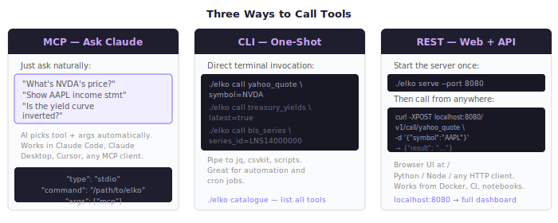

# Quick Start Guide

Get elko running in under 5 minutes.



---

## Table of Contents

1. [Prerequisites](#prerequisites)
2. [Build from Source](#build-from-source)
3. [Environment Setup](#environment-setup)
4. [Interface 1: MCP Server](#interface-1-mcp-server)
5. [Interface 2: CLI](#interface-2-cli)
6. [Interface 3: REST API + Web Dashboard](#interface-3-rest-api--web-dashboard)
7. [Optional: Docker](#optional-docker)
8. [Next Steps](#next-steps)

---

## Prerequisites

- **Go 1.21+** — `go version`
- No API keys required
- One environment variable: `SEC_USER_AGENT` (see below)

---

## Build from Source

```bash
git clone https://github.com/jsoprych/elko-market-mcp
cd elko-market-mcp
go build -o elko ./cmd/elko
```

Verify:

```bash
./elko --help
```

```
Usage:
  elko [command]

Available Commands:
  call        Call a tool by name with key=value arguments
  catalogue   List all available tools and their schemas
  mcp         Start MCP stdio server
  serve       Start REST API server and web dashboard
```

---

## Environment Setup

### SEC EDGAR (required for `edgar_*` tools)

The SEC requires all API clients to identify themselves per their [developer policy](https://www.sec.gov/developer).

```bash
export SEC_USER_AGENT="MyApp me@example.com"
```

Add to your shell profile to make it permanent:

```bash
echo 'export SEC_USER_AGENT="MyApp me@example.com"' >> ~/.bashrc
# or ~/.zshrc
```

Copy `.env.example` to `.env` as a reference:

```bash
cp .env.example .env
# edit .env with your contact details
```

All other sources (Yahoo Finance, Treasury, BLS, FDIC, World Bank) require no credentials.

---

## Interface 1: MCP Server

The MCP interface lets AI assistants call elko tools automatically from natural language prompts.

### Claude Code (project-scoped)

If you cloned this repo, `.mcp.json` is already present. Update the binary path:

```json
{
  "mcpServers": {
    "elko-market": {
      "type": "stdio",
      "command": "/absolute/path/to/elko",
      "args": ["mcp"],
      "env": {
        "SEC_USER_AGENT": "MyApp me@example.com"
      }
    }
  }
}
```

Restart Claude Code. The 10 tools will appear in the MCP tool list.

### Claude Desktop (global)

Edit `~/.config/claude/claude_desktop_config.json` (Linux/Mac: `~/Library/Application Support/Claude/claude_desktop_config.json`):

```json
{
  "mcpServers": {
    "elko-market": {
      "command": "/absolute/path/to/elko",
      "args": ["mcp"],
      "env": {
        "SEC_USER_AGENT": "MyApp me@example.com"
      }
    }
  }
}
```

### Verify MCP is working

In Claude, try:

```
"What's the current AAPL quote?"
```

Claude will call `yahoo_quote` automatically and return live data. See [MCP Setup Guide](MCP-SETUP.md) for Cursor and other clients.

---

## Interface 2: CLI

The `call` command runs any tool by name and prints the result to stdout.

**Syntax:** `./elko call <tool_name> key=value key=value ...`

### First calls

```bash
# Live stock quote
./elko call yahoo_quote symbol=AAPL

# 1 year of daily price history (CSV output)
./elko call yahoo_history symbol=NVDA period=1y interval=1d

# Current Treasury yield curve
./elko call treasury_yields latest=true

# AAPL income statement (last 5 annual filings)
./elko call edgar_financials symbol=AAPL statement=income

# US unemployment rate since 2020
./elko call bls_series series_id=LNS14000000 start_year=2020

# Search FDIC banks in New York
./elko call fdic_bank_search state=NY limit=10

# US GDP last 10 years
./elko call worldbank_indicator country=US indicator=NY.GDP.MKTP.CD
```

### List all available tools

```bash
./elko catalogue
```

### Enable SQLite response cache

```bash
./elko --db ~/.elko-cache.db call yahoo_history symbol=AAPL period=1y
```

Subsequent calls for the same data return instantly from cache (TTL per tool, typically 1h–24h).

### Restrict active sources

```bash
# Only Yahoo Finance tools available
./elko --sources yahoo call yahoo_quote symbol=TSLA

# Multiple sources
./elko --sources yahoo,edgar call edgar_financials symbol=MSFT
```

### Pipe output

```bash
# Price history to CSV file
./elko call yahoo_history symbol=SPY period=5y interval=1wk > spy_weekly.csv

# Quote to jq
./elko call yahoo_quote symbol=AAPL | head -20
```

---

## Interface 3: REST API + Web Dashboard

The `serve` command starts an HTTP server with both a REST API and a browser-based dashboard.

### Start the server

```bash
./elko serve --port 8080
```

```
# With SQLite cache
./elko serve --port 8080 --db ~/.elko-cache.db

# Restrict to specific sources
./elko serve --port 8080 --sources yahoo,edgar,treasury
```

### Open the dashboard

Navigate to `http://localhost:8080` in your browser.

```
Sidebar (left)    → source → category → tool tree
Form (right top)  → auto-generated from tool's JSON Schema
Result (right)    → rendered table / chart / KV output
Toolbar (top)     → back/forward history, export format, download, copy
URL bar           → ?tool=yahoo_history&symbol=AAPL&period=1y (bookmarkable)
```

Charts render automatically for tools that return time-series data (price history, yield curves, BLS series, World Bank indicators).

### REST API

```bash
# Health check
curl http://localhost:8080/health

# List all tools
curl http://localhost:8080/v1/catalogue | jq '.tools[].name'

# Call a tool (JSON body)
curl -s -XPOST http://localhost:8080/v1/call/yahoo_quote \
  -H 'Content-Type: application/json' \
  -d '{"symbol": "NVDA"}'

# Call with multiple args
curl -s -XPOST http://localhost:8080/v1/call/yahoo_history \
  -H 'Content-Type: application/json' \
  -d '{"symbol": "BTC-USD", "period": "1y", "interval": "1wk"}'

# Boolean args
curl -s -XPOST http://localhost:8080/v1/call/treasury_yields \
  -H 'Content-Type: application/json' \
  -d '{"latest": true}'

# EDGAR financials
curl -s -XPOST http://localhost:8080/v1/call/edgar_financials \
  -H 'Content-Type: application/json' \
  -d '{"symbol": "MSFT", "statement": "balance", "frequency": "quarterly"}'
```

See the full [REST API Reference](REST-API.md) for all endpoints and response formats.

---

## Optional: Docker

```bash
# Edit docker-compose.yml and set SEC_USER_AGENT
docker compose up

# Dashboard: http://localhost:8080
```

See the [Docker Deployment Guide](DOCKER.md) for configuration details.

---

## Next Steps

| I want to… | Read… |
|-----------|-------|
| See all tool arguments and output formats | [Tool Reference](TOOLS.md) |
| Configure Claude Desktop or Cursor | [MCP Setup Guide](MCP-SETUP.md) |
| Query the REST API programmatically | [REST API Reference](REST-API.md) |
| Add a new data source | [Channel Creation Guide](CHANNELS.md) |
| Understand how it works internally | [Architecture](ARCHITECTURE.md) |
| Deploy with Docker | [Docker Guide](DOCKER.md) |
| See workflow examples (earnings, macro, banking) | [How-To Cookbook](HOW-TO.md) |
