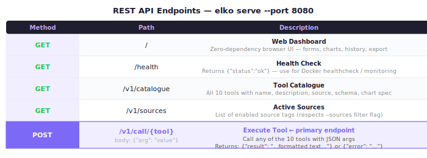

# REST API Reference



The `elko serve` command starts an HTTP server with a REST API and web dashboard.

```bash
./elko serve --port 8080
./elko serve --port 8080 --db ~/.elko-cache.db
./elko serve --port 8080 --sources yahoo,edgar
```

Default port: `8080`

---

## Table of Contents

1. [Endpoints](#endpoints)
2. [Authentication](#authentication)
3. [Request Format](#request-format)
4. [Response Format](#response-format)
5. [Error Handling](#error-handling)
6. [All Endpoints in Detail](#all-endpoints-in-detail)
   - [GET /health](#get-health)
   - [GET /v1/catalogue](#get-v1catalogue)
   - [GET /v1/sources](#get-v1sources)
   - [POST /v1/call/{tool}](#post-v1calltool)
7. [Examples](#examples)

---

## Endpoints

| Method | Path | Description |
|--------|------|-------------|
| `GET` | `/` | Web dashboard (SPA) |
| `GET` | `/health` | Server health check |
| `GET` | `/v1/catalogue` | All tools with schemas and metadata |
| `GET` | `/v1/sources` | Available source tags |
| `POST` | `/v1/call/{tool}` | Execute a named tool |

---

## Authentication

None. The API is unauthenticated. It is designed for local use — bind to `localhost` (default) or restrict network access if deploying beyond localhost.

---

## Request Format

### POST /v1/call/{tool}

Arguments are passed as a JSON object in the request body:

```
Content-Type: application/json

{"key": "value", "key2": "value2"}
```

**Type coercion:**
- `boolean` schema fields: pass JSON `true`/`false`
- `integer` schema fields: pass JSON numbers
- `string` fields: pass JSON strings

**Example:**

```bash
curl -s -XPOST http://localhost:8080/v1/call/treasury_yields \
  -H 'Content-Type: application/json' \
  -d '{"latest": true}'
```

---

## Response Format

### Success

```json
{
  "result": "<formatted text output>"
}
```

The `result` field is always a string. Its internal format (CSV, table, key-value, etc.) is declared in the tool's `result_format` field from `/v1/catalogue`.

### Error

```json
{
  "error": "<error message>"
}
```

HTTP status codes:
- `200` — success
- `400` — bad request (unknown tool, invalid args)
- `500` — tool execution error (API failure, parse error)

---

## Error Handling

Tool errors are returned as JSON with an `"error"` key. The HTTP status code will be `400` or `500`.

```bash
# Unknown tool
curl -s -XPOST localhost:8080/v1/call/nonexistent \
  -H 'Content-Type: application/json' -d '{}'
# → {"error": "tool not found: nonexistent"}

# Missing required argument
curl -s -XPOST localhost:8080/v1/call/yahoo_quote \
  -H 'Content-Type: application/json' -d '{}'
# → {"error": "symbol is required"}

# Upstream API error
# → {"error": "yahoo finance: 404 Not Found — ..."}
```

---

## All Endpoints in Detail

### GET /health

Health check. Returns server status, version, and active tool count.

**Request:**
```bash
curl http://localhost:8080/health
```

**Response:**
```json
{
  "status": "ok",
  "version": "0.1.0",
  "tools": 10
}
```

---

### GET /v1/catalogue

Returns all registered tools with full metadata: description, source, category, JSON Schema, result format, and chart spec.

**Request:**
```bash
curl http://localhost:8080/v1/catalogue
```

**Query parameters:**

| Parameter | Description |
|-----------|-------------|
| `source` | Filter by source (e.g. `?source=yahoo`) |
| `category` | Filter by category (e.g. `?category=equity`) |

**Response:**
```json
{
  "tools": [
    {
      "name": "yahoo_quote",
      "description": "Current quote + metadata from Yahoo Finance...",
      "source": "yahoo",
      "category": "equity",
      "result_format": "kv",
      "schema": {
        "type": "object",
        "properties": {
          "symbol": {
            "type": "string",
            "description": "Ticker symbol",
            "placeholder": "AAPL"
          }
        },
        "required": ["symbol"]
      }
    },
    {
      "name": "yahoo_history",
      "description": "OHLCV price history from Yahoo Finance...",
      "source": "yahoo",
      "category": "equity",
      "result_format": "csv",
      "chart": { "type": "line", "x": "Date", "y": "Close" },
      "schema": { ... }
    },
    ...
  ]
}
```

**Filter examples:**
```bash
# Yahoo Finance tools only
curl "localhost:8080/v1/catalogue?source=yahoo"

# Equity tools only
curl "localhost:8080/v1/catalogue?category=equity"

# Just the names
curl localhost:8080/v1/catalogue | jq '.tools[].name'
```

---

### GET /v1/sources

Returns the list of active source tags.

**Request:**
```bash
curl http://localhost:8080/v1/sources
```

**Response:**
```json
{
  "sources": ["yahoo", "edgar", "treasury", "bls", "fdic", "worldbank"]
}
```

If started with `--sources yahoo,edgar`, only those two sources are returned.

---

### POST /v1/call/{tool}

Execute a named tool with JSON arguments.

**Request:**
```
POST /v1/call/{tool}
Content-Type: application/json

{<args object>}
```

**Response:**
```json
{
  "result": "<formatted text>"
}
```

---

## Examples

### Quick test of all tool types

```bash
BASE=http://localhost:8080

# Quote (key-value output)
curl -s -XPOST $BASE/v1/call/yahoo_quote \
  -H 'Content-Type: application/json' \
  -d '{"symbol":"AAPL"}'

# Price history (CSV output)
curl -s -XPOST $BASE/v1/call/yahoo_history \
  -H 'Content-Type: application/json' \
  -d '{"symbol":"NVDA","period":"1mo","interval":"1d"}'

# EDGAR income statement (table output)
curl -s -XPOST $BASE/v1/call/edgar_financials \
  -H 'Content-Type: application/json' \
  -d '{"symbol":"MSFT","statement":"income","frequency":"annual"}'

# Treasury yields (boolean arg)
curl -s -XPOST $BASE/v1/call/treasury_yields \
  -H 'Content-Type: application/json' \
  -d '{"latest":true}'

# BLS series
curl -s -XPOST $BASE/v1/call/bls_series \
  -H 'Content-Type: application/json' \
  -d '{"series_id":"LNS14000000","start_year":"2020"}'

# FDIC search
curl -s -XPOST $BASE/v1/call/fdic_bank_search \
  -H 'Content-Type: application/json' \
  -d '{"name":"Wells Fargo","limit":5}'

# FDIC financials
curl -s -XPOST $BASE/v1/call/fdic_bank_financials \
  -H 'Content-Type: application/json' \
  -d '{"cert":"3511"}'

# World Bank
curl -s -XPOST $BASE/v1/call/worldbank_indicator \
  -H 'Content-Type: application/json' \
  -d '{"country":"US","indicator":"NY.GDP.MKTP.CD","from_year":2015}'
```

### Use with jq

```bash
# Extract just the result text
curl -s -XPOST localhost:8080/v1/call/yahoo_quote \
  -H 'Content-Type: application/json' \
  -d '{"symbol":"AAPL"}' | jq -r '.result'

# Check for errors
RESP=$(curl -s -XPOST localhost:8080/v1/call/yahoo_quote \
  -H 'Content-Type: application/json' \
  -d '{"symbol":"INVALID_XXX"}')
echo $RESP | jq 'if .error then "ERROR: \(.error)" else .result end'
```

### Use from Python

```python
import requests

def call_tool(tool: str, args: dict, base_url="http://localhost:8080") -> str:
    resp = requests.post(
        f"{base_url}/v1/call/{tool}",
        json=args,
        headers={"Content-Type": "application/json"}
    )
    data = resp.json()
    if "error" in data:
        raise RuntimeError(data["error"])
    return data["result"]

# Examples
quote = call_tool("yahoo_quote", {"symbol": "AAPL"})
history = call_tool("yahoo_history", {"symbol": "AAPL", "period": "1y", "interval": "1d"})
yields = call_tool("treasury_yields", {"latest": True})
```

### Use from Node.js

```javascript
async function callTool(tool, args, baseUrl = 'http://localhost:8080') {
  const res = await fetch(`${baseUrl}/v1/call/${tool}`, {
    method: 'POST',
    headers: { 'Content-Type': 'application/json' },
    body: JSON.stringify(args),
  });
  const data = await res.json();
  if (data.error) throw new Error(data.error);
  return data.result;
}

// Examples
const quote   = await callTool('yahoo_quote', { symbol: 'NVDA' });
const history = await callTool('yahoo_history', { symbol: 'BTC-USD', period: '1y', interval: '1wk' });
const gdp     = await callTool('worldbank_indicator', { country: 'US', indicator: 'NY.GDP.MKTP.CD' });
```

### Use from shell scripts

```bash
#!/bin/bash
# fetch_earnings.sh — pull full earnings data for a ticker

SYMBOL=${1:-AAPL}
BASE=http://localhost:8080

echo "=== Quote ==="
curl -s -XPOST $BASE/v1/call/yahoo_quote \
  -H 'Content-Type: application/json' \
  -d "{\"symbol\":\"$SYMBOL\"}" | jq -r '.result'

echo "=== Income Statement ==="
curl -s -XPOST $BASE/v1/call/edgar_financials \
  -H 'Content-Type: application/json' \
  -d "{\"symbol\":\"$SYMBOL\",\"statement\":\"income\"}" | jq -r '.result'

echo "=== Cash Flow ==="
curl -s -XPOST $BASE/v1/call/edgar_financials \
  -H 'Content-Type: application/json' \
  -d "{\"symbol\":\"$SYMBOL\",\"statement\":\"cashflow\"}" | jq -r '.result'
```
